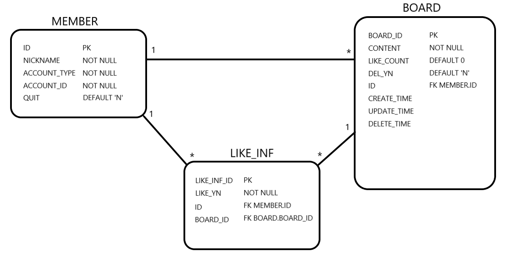

# 프로젝트 생성

- Spring Boot 2.7.8 버전 사용
- Java 1.8 OpenJDK 사용
- Dependency
  - H2Database
  - Spring Web
  - Thymeleaf
  - Spring Data JPA
  - Spring cache abstraction
  - ehcache3 (따로 추가해줘야함 '캐시 사용')

# 엔티티 설계

- Member(회원 엔티티)
- DateEntity(기본 Date엔티티 - MappedSuperclass)
- Board(게시글 엔티티)
- LikeInf(좋아요 엔티티)

# 권한 체크
- AuthCheck(권한체크 어노테이션)
- AuthCheckAspect(권한 체크 Aspect)
  - 'Authentication'의 헤더 값으로 계정을 찾고 글 목록 조회 서비스를 제외한 서비스를 요청시 계정 타입이 없을 경우 예외 발생
- AccountType(계정 타입 Enum)
  - Realtor
  - Lessor
  - Lessee

# 비즈니스 로직
- **BoardController**
  - *글 등록, 수정, 삭제 url: http://localhost:8080/zaritalk/api/v1/board/edit*
    - Post, Put, Delete Method 구현 Json 형식으로 특정 데이터를 보내줘야함
  - *좋아요 url: http://localhost:8080/zaritalk/api/v1/board/like/{board_id}*
    - queryParameter에 게시글 번호를 보내줘야함
  - *글 목록 조회 url: http://localhost:8080/zaritalk/api/v1/board/getList*
    - `BoardDto` 객체를 리스트로 응답
- **BoardService**
  - *글 목록 조회 getBoards*
    - `Board` 엔티티를 jpql `select distinct board from Board board left join fetch board.likeInfs`로 조회 후 요청한 `Member`의 `ID`와 조회한 `Board`의 `LikeInfs`의 `Member`의 `ID`값을 비교해서 좋아요 여부값을 세팅한다. 
    - `Board` 엔티티를 `BoardDto` 객체로 변환하여 리스트로 반환
  - *글 등록 createBoard*
    - `Board` 엔티티에 생성날짜 세팅 후 저장
  - *글 수정 updateBoard*
    - 입력받은 `BoardId`로 `Board`를 조회 후 입력받은 `Content` 값으로 변경 및 수정 날짜 세팅
  - *글 삭제 deleteBoard*
    - 입력받은 `BoardId`로 `Board`를 조회 후 `DelYn`값 'Y', 삭제 날짜 세팅
  - *좋아요 토글 likeToggle*
    - 입력받은 `Board`랑 `Member`로 `LikeInf` 조회 후 없을 경우 엔티티를 생성하고 있을 경우 `likeYn` 값을 반대로 세팅
  - *좋아요 토글 후 게시글에 좋아요 수 업데이트 updateLikeCnt*
    - `Board` 엔티티의 `LikeInfs`를 조회해서 `LikeYn`값이 Y인 엔티티만 카운트해서 수정
- **MemberService**
  - *회원 조회 getMembers*
    - 헤더 `Authentication` 값으로 `AccountType`, `AccountId` 값 세팅해서 `Member` 엔티티 조회
- BoardRepository
- MemberRepository
- LikeInfRepository

# 캐시 적용
- Dependency 추가
```
implementation 'org.ehcache:ehcache:3.8.1'
implementation 'javax.cache:cache-api:1.0.0'
```
- application 에 `@EnableCaching` 추가
- *ehcache.xml* 추가

- MemberRepository
  - `Member` 조회에 캐시 적용
  - `@Cacheable(cacheNames = "findMemberCache", unless = "#result == null")` 적용
- BoardRepository
  - `BoardList` 조회에 캐시 적용
  - `@Cacheable(cacheNames = "findBoardsCache", unless = "#result == null")` 적용
- BoardService
  - 글 등록, 수정, 삭제, 좋아요 시 `findBoardsCache` 캐시 날림
  - `@CacheEvict(value = "findBoardsCache", allEntries = true)` 적용

# 예외 처리
- **사용자 정의 익셉션**
  - `BoardNotFoundException`
  - `MemberNotFoundException`
  - `AccountTypeNotFoundException`
  - `NonPermissionException`
  - `NoRequiredException`
  - `ConstraintViolationException`
- **ExceptionCode(사용자 정의 익셉션 Enum)**
  - `NOT_FOUND_BOARD(HttpStatus.NOT_FOUND)`
  - `NOT_FOUND_MEMBER(HttpStatus.NOT_FOUND)`
  - `NOT_FOUND_ACCOUNT(HttpStatus.NOT_FOUND)`
  - `NO_PERMISSION(HttpStatus.FORBIDDEN)`
  - `NO_REQUIRED(HttpStatus.BAD_REQUEST)`
  - `CONSTRAINT_VIOLATION(HttpStatus.BAD_REQUEST)`
- **ExceptionController**
  - 예외 발생시 예외 처리 및 응답